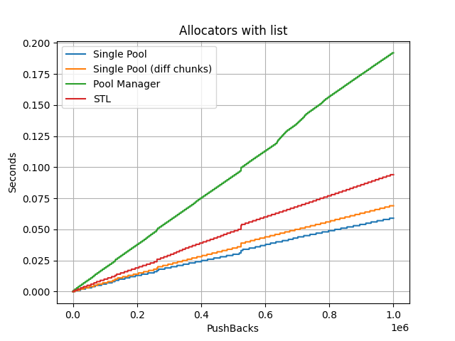

# Аллокатор Memory Pool

Аллокатор, работающий на основе выделенных заранее блоков памяти, соответствующий [требованиям к аллокаторам](https://en.cppreference.com/w/cpp/named_req/Allocator).

## Принцип работы

- Для аллокации памяти аллокатор использует заранее выделенные участки памяти
- Память изначальльно выделяется [пулами](https://en.wikipedia.org/wiki/Memory_pool)
- Пулы бьются на кусочки одинакового размера
- Пул умеет выделять и освобождать память только кусочками (один или более)
- Пул обладает информацией о свободных и занятых кусочках
- Пул очищает память лишь в конце своей "жизни"
- Аллокатор при выделении памяти размером в N байт ищет среди пулов наиболее подходящий так, чтобы наиболее оптимально выделять память. Если это невозможно, то выбрасывается исключение std::bad_alloc
- При освобождении через аллокатор, кусочки памяти вновь пригодны для использования

## Параметры

Размеры пулов, их количество, а также размеры кусочков параметризуются.

## Бенчмаркинг

Произведено сравнение с стандарным аллокатором при взаимодействии с контейнерами, полученные результаты изображены на графиках в папке [стресс-тестов](stress-tests/).

